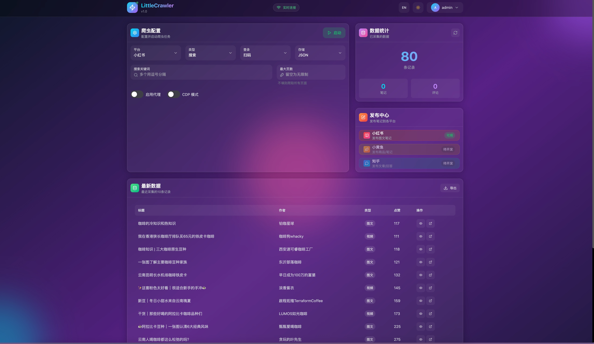

# LittleCrawler

<p align="center">
  <b>基于 Python 异步编程的多平台社交媒体爬虫框架</b>
</p>

<p align="center">
  
  
  
  
  
  
  
</p>

<p align="center">
  
  
</p>

---

## 🌐 支持平台

| 平台   | 代号    | 功能             |
| ------ | ------- | ---------------- |
| 小红书 | `xhs`   | 笔记、详情、作者 |
| 知乎   | `zhihu` | 文章、详情、作者 |

## 🚀 快速开始

### 📦 环境要求

- Python 3.12
- [uv](https://github.com/astral-sh/uv)
- Node.js 18+ 与 npm（仅 Web 后台需要）

### 📥 安装

```bash
# 克隆项目
git clone https://github.com/pbeenig/LittleCrawler.git
cd LittleCrawler

# 安装运行与开发依赖（自动创建 .venv）
uv sync --locked --group dev

# 安装浏览器
uv run playwright install chromium
```

### ▶️ 运行

```bash
# 默认运行（使用 config/base_config.py 配置）
uv run python main.py

# 指定平台和爬虫类型
uv run python main.py --platform xhs --type search

# 初始化数据库
uv run python main.py --init_db sqlite
```

`pyproject.toml` 与 `uv.lock` 是项目依赖的唯一来源。`requirements.txt`
仅作为旧部署环境的兼容导出文件，请不要手工编辑。

### 🖥️ Web 后台

```bash
# 完整部署：安装依赖并编译前端页面到 `api/ui`
cd ./web
npm install
npm run build
cd ..

# 启动完整服务（API + 前端页面）
uv run uvicorn api.main:app --port 8080 --reload

# 访问 http://127.0.0.1:8080
```

开发时可分别启动 API 与 Web：

```bash
# 终端 1：启动仅 API 服务
API_ONLY=1 uv run uvicorn api.main:app --port 8080 --reload

# 终端 2：开发模式启动 Web 后台（首次启动先运行 npm install）
cd ./web
npm run dev
# 访问 http://localhost:3000
```

前后端分离部署时，可用逗号分隔的环境变量配置允许访问 API 的前端来源：

```bash
LITTLECRAWLER_CORS_ORIGINS=http://localhost:3000,https://crawler.example.com \
  uv run uvicorn api.main:app --port 8080
```

## 📸 界面预览

<table>
  <tr>
    <td align="center"><b>🔐 登录</b></td>
    <td align="center"><b>🚀 启动</b></td>
  </tr>
  <tr>
    <td></td>
    <td></td>
  </tr>
  <tr>
    <td align="center" colspan="2"><b>📊 首页</b></td>
  </tr>
  <tr>
    <td colspan="2" align="center"></td>
  </tr>
</table>

### 🛠️ 命令工具

```bash

## 清除 缓存数据  (node_modules|.venv|.git|.next|out|browser_data|data|.codacy )
find . -type d -name "__pycache__" -exec rm -rf {} + 2>/dev/null; tree -L 2 -d --noreport -I 'node_modules|.venv|.git|.next|out|browser_data|data|.codacy'

## 查看 CLI 帮助
uv run python main.py --help

## 代码质量
uv run ruff check .
uv run mypy
uv run pytest

## 格式化本次修改的 Python 文件
uv run ruff format path/to/changed_file.py

## 安装 Git 提交前检查
uv run pre-commit install

```

## ⚙️ 配置说明

编辑 `config/base_config.py`：

```python
PLATFORM = "xhs"           # 目标平台
KEYWORDS = "关键词1,关键词2" # 搜索关键词
CRAWLER_TYPE = "search"    # search | detail | creator
LOGIN_TYPE = "qrcode"      # qrcode | phone | cookie
SAVE_DATA_OPTION = "json"  # csv | json | db | sqlite | mongodb | excel
ENABLE_CDP_MODE = True     # CDP模式（推荐，反检测更强）
ENABLE_IP_PROXY = False    # 是否启用代理
```

## 📁 项目结构

```
├── main.py                  # 程序入口
├── config/                  # 配置文件
├── src/                     # 核心源码
│   ├── core/                # 核心模块（基类、命令行、上下文变量）
│   ├── platforms/           # 平台爬虫实现
│   │   ├── xhs/             # 小红书爬虫
│   │   └── zhihu/           # 知乎爬虫
│   ├── storage/             # 数据存储层
│   │   ├── base/            # 通用存储（DB、Excel、MongoDB）
│   │   ├── xhs/             # 小红书存储实现
│   │   └── zhihu/           # 知乎存储实现
│   ├── models/              # Pydantic 数据模型
│   ├── services/            # 服务层
│   │   ├── cache/           # 缓存（本地/Redis）
│   │   └── proxy/           # 代理IP管理
│   └── utils/               # 工具函数
├── api/                     # Web API 后台
├── web/                     # 前端界面
├── tests/                   # 测试用例
├── docs/                    # 文档
├── data/                    # 数据输出
└── libs/                    # 第三方依赖（JS）
```

## 💾 数据存储

| 方式    | 配置值    | 说明       |
| ------- | --------- | ---------- |
| CSV     | `csv`     | 简单通用   |
| JSON    | `json`    | 结构完整   |
| SQLite  | `sqlite`  | 轻量本地   |
| MySQL   | `db`      | 生产环境   |
| MongoDB | `mongodb` | 灵活扩展   |
| Excel   | `excel`   | 可视化分析 |

## 📄 License

MIT


## 🚀 赞助商

<p align="center">
  <b></b>
</p>

IPWO 提供全球住宅代理资源，为爬虫开发、数据采集和自动化任务提供更灵活的网络环境支持。
无论是项目测试、数据分析还是多地区访问需求，都可以根据业务场景选择合适的代理方案。

[访问IPWO](https://www.ipwo.net/?ref=githubpbeenigg)  
